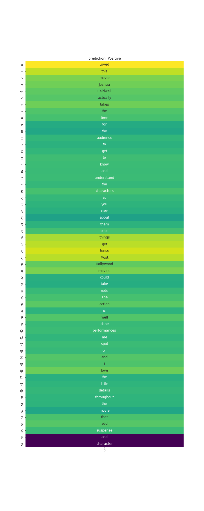

# Attention_text_classification
Interpreting the outputs of LSTM/GRU for the text classification task using modified bahdanau attention mechanism

- Developed a modified bahdanau attention model to interpret the LSTM/GRU models for task classification (Both binary and multi-label)
- Dataset : IMDB review dataset
## Output

